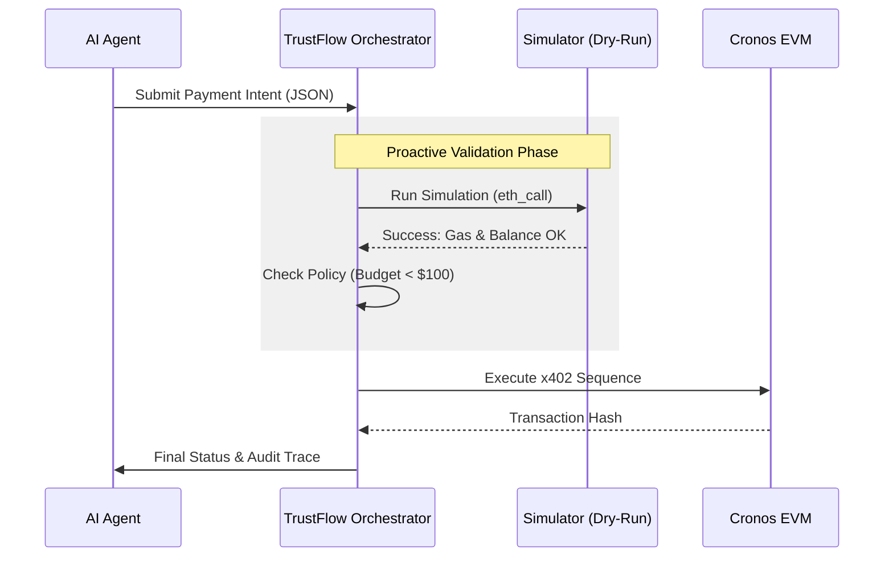

# 🛡️ TrustFlow: Transparency & Control for AI Agents

TrustFlow is a **security orchestration layer** designed to sit between AI Agents and the Blockchain. It transforms "Black Box" AI decisions into "Glass Box" verifiable workflows, ensuring safety, compliance, and explainability.

### The Problem
**AI Agents are black boxes.** When an agent triggers a blockchain transaction, developers face a "leap of faith." A single bug, gas spike, or malicious contract can lead to irreversible financial loss.

### The Solution
TrustFlow provides the **Safety Valve** for the AI Agent economy. We ensure that every AI "Intent" is simulated and validated against real-world constraints before it ever touches the blockchain.

---

## 🏗️ Architecture

TrustFlow acts as a middleware that **Simulates**, **Validates**, and **Logs** every transaction before execution.


### Execution Flow



---

## 🚀 Features

### 1. **Proactive Trust (The Simulator)**
Before any funds move, TrustFlow runs a "Dry Run" simulation.
- **Balance Checks**: Prevents "Insufficient Funds" errors before they hit the chain.
- **Contract Scanning**: Detects potential reverts or malicious patterns.
- **Budget Enforcement**: Ensures transactions stay within daily limits (e.g., $100).

### 2. **Fail-Safe Orchestration**
- **Multi-Step Workflows**: Handles complex sequences (e.g., `Approve` -> `Transfer`).
- **Atomic Halting**: If Step 1 fails, the workflow **stops immediately**. No partial states or stuck funds.

### 3. **The "Glass Box" Dashboard**
A React-style Streamlit UI that provides deep observability:
- **🚦 Traffic Light Status**: Green (Safe), Red (Blocked).
- **🛑 Human-Readable Errors**: Translates `execution reverted` into *"PREVENTED: Contract Rejection"*.
- **📜 Audit Trace**: Side-by-side view of the **Raw Intent (JSON)** vs. **Execution Result**.

### 4. **Persistent Audit Log**
Every action is recorded in a local SQLite database (`trustflow.db`), ensuring a permanent, queryable history of all AI actions.

---

## ⚡ Quick Start

### Prerequisites
- Docker & Docker Compose
- Go 1.23+ (optional, for local dev)

### One-Click Deploy
Run the entire stack (Server + Dashboard + Database) with a single command:

```bash
docker compose up --build
```

- **API Server**: `http://localhost:8081`
- **Dashboard**: `http://localhost:8501`

---

## 🔌 API Reference

### 1. Submit Intent
**POST** `/intents`

```json
{
  "steps": [
    {
      "action": "payment",
      "params": {
        "to": "0x742d35Cc6634C0532925a3b844Bc454e4438f44e",
        "amount": "0.1",
        "token": "TCRO"
      }
    }
  ]
}
```

### 2. Check Status (Polling)
**GET** `/status/:id`

Returns the real-time state of the intent, including simulation results and execution steps.

---

## 📂 Project Structure

```
TrustFlow/
├── dashboard/          # Streamlit UI
│   ├── app.py          # Frontend Logic (Visualizer)
│   └── Dockerfile      # Python Environment
├── src/
│   ├── cmd/server/     # Go Entrypoint
│   ├── internal/
│   │   ├── orchestrator/ # Core Logic (Fail-Safe)
│   │   ├── simulator/    # Safety Checks
│   │   └── storage/      # SQLite Implementation
│   └── pkg/types/      # Shared Data Models
├── docker-compose.yml  # Stack Orchestration
└── Dockerfile          # Go Server Build (Multi-Stage)
```

---

## � Roadmap & Vision

- **Phase 1**: Multi-Signature Human Approval for large AI transactions.
- **Phase 2**: Integration with Crypto.com AI Agent SDK.
- **Phase 3**: Automated "Self-Healing" for stuck transactions.

---

*Built with ❤️ for the AI Agent Economy.*
